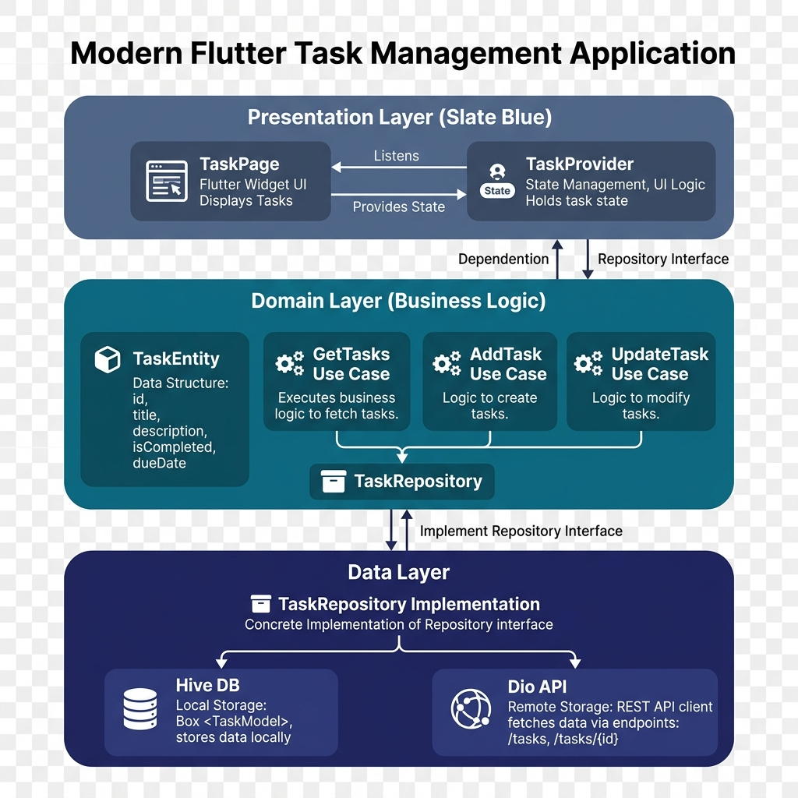

# 🚀 Flutter Task Management - Clean Architecture

<p align="center">
  
  
  
</p>

A high-performance Task Management application built with **Clean Architecture** and an **Offline-First** strategy. This project is a professional showcase of modern Flutter engineering by **Inheritx Solutions**.

---

## ✨ Key Features

- **🏆 Clean Architecture**: Strict separation of concerns (Data, Domain, Presentation).
- **📶 Offline-First Strategy**: Seamless experience with local caching using **Hive DB**.
- **🎨 Premium UI/UX**: Modern design system with smooth animations.
- **⚡ Optimistic Updates**: Instant UI feedback for a lag-free user experience.
- **🔄 Robust State Management**: Scalable architecture using the **Provider** pattern.
- **🌐 Network Resilience**: Custom API service with Dio, featuring interceptors and error handling.

---

## 🏗 Architecture & Design

This project follows **Clean Architecture** principles to ensure that the business logic is independent of frameworks, UI, and databases. This makes the app highly testable and maintainable.

### Visual Architecture Flow
The following diagram illustrates how the **Task Management** feature is structured across the layers:

<p align="center">
  
</p>

---

## 🛠 Core Technologies

We leverage the following industry-standard technologies to build a robust application:

| Technology | Purpose |
| :--- | :--- |
| **Flutter** | Cross-platform framework for high-fidelity UI |
| **Provider** | Efficient state management and dependency injection |
| **Hive** | Lightweight and blazing fast key-value database for offline caching |
| **Dio** | Powerful HTTP client with support for interceptors and global config |
| **ScreenUtil** | Ensuring UI consistency across all screen sizes |

---

## 📂 Project Structure

```text
lib/
├── config/             # Theme, Routes, and Environment config
├── core/               # Global services, utils, and base classes
├── features/           # Feature-driven modules
│   └── task/
│       ├── data/       # Models, Repositories, Data Sources
│       ├── domain/     # Entities, Use Cases, Repository Interfaces
│       └── presentation/# Pages, Providers, Widgets
└── main.dart           # Application entry point
```

---

## 🚀 Getting Started

1. **Clone the repository**
   ```bash
   git clone https://github.com/your-username/your-repo-name.git
   ```

2. **Install dependencies**
   ```bash
   flutter pub get
   ```

3. **Run the app**
   ```bash
   flutter run
   ```

---

<p align="center">
  <b>Developed & Maintained by Inheritx Solutions</b><br>
  A Professional Showcase of Modern Flutter Engineering
</p>